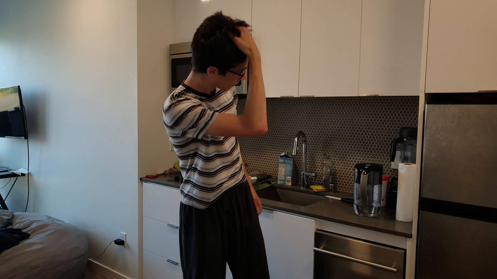
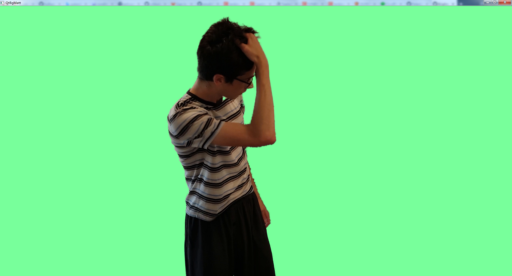

# Qt-BgMatte
The C++ code is based on [BackgroundMattingV2](https://github.com/PeterL1n/BackgroundMattingV2).

 

## Platforms & Tools
* Windows 7 x64
* Visual Studio 2017
* Qt 5.9.8

## Requirements
* [libtorch](https://download.pytorch.org/libtorch/cu102/libtorch-win-shared-with-deps-1.8.1%2Bcu102.zip)
* [CUDA 10.2](https://developer.download.nvidia.com/compute/cuda/10.2/Prod/network_installers/cuda_10.2.89_win10_network.exe)

## Demo
### src

### res

